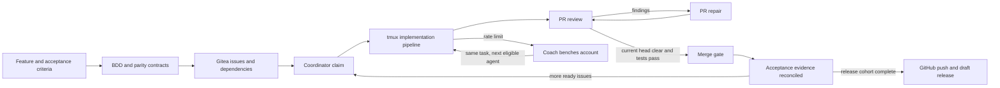

# The Gitea Code Factory

[](https://github.com/CraigThomasParsons/TheGiteaCodeFactory/actions/workflows/check.yml)

A blueprint, with working parts, for letting AI coding agents (Codex, Claude,
Gemini and others) deliver software on a self-hosted Gitea server: from a written
feature description to reviewed, tested, merged code and a draft release, over
days or weeks, without a human babysitting each step.

The core rule is **never take an agent's word that it finished**. Every stage has
to leave evidence the next stage can check: exact commit SHAs, the commands that
ran and their exit codes, and reviews tied to the PR's current head. A green
label, an exit code of 0 or a recent timestamp never counts as done. A feature is
done only when its acceptance criteria are proven on merged code.

New to the vocabulary (slice, oracle, parity, claim, receipt, bench)? Keep the
[glossary](docs/glossary.md) open while you read.

## What it can do

- **Turn feature descriptions into executable contracts.** Acceptance criteria
  become Gherkin (BDD) scenarios, plus a *crosswalk* tying each criterion to the
  scenarios and test commands that prove it. A coverage audit catches criteria
  with no scenario and scenarios with no criterion.
- **Prove a rewrite behaves like the original.** When migrating an existing
  system, the same scenarios run against the old system (the *oracle*) and the
  new one, twice each. The results must match exactly and be deterministic.
- **Implement issues with agents, one clean phase at a time.** Each issue goes
  through `IMPL → SIMPLIFY → ARCHITECTURE → REVIEW → PR`. Every phase is a fresh
  agent session in tmux, on an isolated worktree, writing a receipt of what it did.
  Test-driven development guides the implementation.
- **Review and repair PRs automatically.** Two independent reviews run on the
  current head: *Standards* (does it follow the repo's rules?) and *Spec* (does it
  do what the issue asked?). Findings are fixed, tests rerun and the PR
  re-reviewed, for up to three rounds before it is parked for a human.
- **Merge only with proof.** A separate, deterministic merge gate merges only when
  a private receipt matches the exact head and base, both reviews are clear and
  required checks pass. It then verifies the resulting merge commit.
- **Survive rate limits.** When an agent account hits its usage limit, the coach
  puts that account on cooldown and hands the *same* task (branch, uncommitted
  work, evidence) to the next eligible agent instead of restarting or failing it.
- **Gate merges on your own CI.** A Gitea Actions workflow runs the project's
  tests on every PR and publishes the status check the merge gate requires.
- **Add an advisory AI review in CI.** A Gitea Actions workflow posts a
  model-written review on each PR, with a fallback chain of providers and a
  secret-pattern scan of the diff.
- **Prepare releases safely.** When a frozen set of issues is complete, push
  explicit refs to GitHub and prepare a *draft* release. Publishing stays a human
  decision.

## How the factory works



1. **Specify.** Write what the user should observe, including failure cases, as
   numbered acceptance criteria.
2. **Contract.** The `bdd` skill turns those into scenarios with real step
   bindings and a crosswalk. Migrations also freeze a green oracle for the
   `parity` skill; greenfield projects mark parity *not applicable*.
3. **Queue.** The `dispatcher` skill audits coverage and creates Gitea issues with
   dependencies. Issues become ready only once their prerequisites have evidence.
4. **Claim.** A coordinator gives each job to exactly one worker computer, so two
   machines never write the same branch. With a single worker you can skip this:
   local branch locks already enforce one writer per branch.
5. **Implement.** The worker runs the five phases above, each in a fresh
   session. The PR phase hands the PR to the review controller; workers never merge.
6. **Review and repair.** The review loop labels the PR (`review:requested →
   review:findings → review:resolved → review:requested`) until the current head
   is clear, or parks it with `review:needs-human`.
7. **Merge and reconcile.** The merge gate checks the receipt and merges. Only
   then are the issue's acceptance criteria marked proven.
8. **Release.** Once every issue in the release cohort is accounted for, validate
   the release commit, push explicit refs to GitHub and draft the release.

### A PR's trip through the review loop

This is the part most people adopt first, and it works without the rest.

1. A PR is opened and labelled `review:requested`. Gitea Actions starts running
   the project's tests on it, and optionally posts an advisory AI review.
2. The review loop picks it up, runs the `code-review` skill (independent
   Standards and Spec reviews) and posts the result as a PR comment. The label
   becomes `review:findings`, or `review:clear` if there is nothing to fix.
3. The resolve loop picks up `review:findings` PRs, fixes the findings on the PR's
   branch, reruns the tests, pushes and sends it back to `review:requested`.
4. Steps 2–3 repeat on each new head, up to three rounds. A PR that still isn't
   clear, or needs a human decision, is parked as `review:needs-human`.
5. Once a PR is `review:clear` *and* its tests have passed on that exact commit,
   the merge gate merges it into the target branch (for example `develop`) and
   verifies the merge.

### Where things run

| Runs in Gitea Actions (per PR, short-lived) | Runs on a worker computer (long-lived, needs agent logins) |
|---|---|
| The project's tests (`pr-validation.yml`) | The review and resolve loops |
| The advisory AI review (`pr-ai-review.yml`) | The implementation pipeline (tmux sessions) |
| | The coach and merge gate |

The agent work stays off Actions on purpose. Agent sessions run for a long time,
need authenticated CLIs and write to branches, and CI jobs are short-lived,
disposable and run PR code. On the worker, start the loops on demand by asking
your agent, or on a schedule with cron or a systemd timer.

Four design rules hold throughout:

| Rule | Why |
|---|---|
| **Evidence over claims** | Agents report success when they fail. Only receipts pinned to exact SHAs count. |
| **One writer per branch** | Two agents on one branch corrupt each other's work. Local locks plus coordinator claims enforce it. |
| **Separation of powers** | The agent that writes code doesn't review it; the reviewer doesn't merge; the merge gate doesn't publish. |
| **Fresh context per phase** | A new session per phase stops one phase's mistaken assumptions leaking into the next. |

The full lifecycle, ownership table and failure handling are in
[docs/lifecycle.md](docs/lifecycle.md).

## How to use it

Cloning this repository starts nothing, enrolls nothing, merges nothing and
publishes nothing. You adopt it in layers; each layer is useful on its own.

### Layer 1: use the skills in any repository

The [skills/](skills/) are portable instructions for agents, in the `SKILL.md`
format that Codex and Claude Code both read. Install the whole set into a project
(the installer refuses to overwrite skills that already exist):

```bash
python3 scripts/install-skills.py --destination /path/to/project/.agents/skills
# Claude Code users: --destination /path/to/project/.claude/skills
```

Then ask your agent for one, for example `$tdd` in Codex or `/tdd` in Claude
Code: *"Use tdd to add rate limiting to the login endpoint"*. Useful on their own:
`tdd`, `bdd`, `code-review`, `simplify`, `improve-codebase-architecture`.
[docs/catalog.md](docs/catalog.md) lists every skill and script.

### Layer 2: automated PR review, repair and merge on Gitea

1. Run Gitea with Actions. Use the included Compose file for a new server, or add
   a runner to the Gitea you already have ([docs/setup.md](docs/setup.md)):

   ```bash
   bash scripts/bootstrap.sh          # creates .env and an empty secrets/ dir
   docker compose up -d gitea         # then finish setup at http://localhost:3300
   ```

2. In the target repository, add `.factory/project.json` from
   [templates/factory-project.example.json](templates/factory-project.example.json):
   its validation commands, required status checks, merge method and whether
   auto-merge is allowed.
3. Copy [templates/pr-validation.yml](templates/pr-validation.yml) to
   `.gitea/workflows/` and replace its placeholder with the project's tests. This
   produces the status check the merge gate waits for.
4. Create the `review:*` labels and turn on branch protection, with that check
   required.
5. Point the agent at a PR:

   ```text
   Use $pr-review-resolve-loop for owner/project on the configured Gitea server.
   Process at most two PRs, up to three repair rounds each.
   ```

   Add the advisory CI reviewer by copying
   [templates/pr-ai-review.yml](templates/pr-ai-review.yml) into
   `.gitea/workflows/` ([docs/pr-loops.md](docs/pr-loops.md)).

### Layer 3: the full factory

Add contracts, the implementation pipeline, the coach and (with more than one
worker computer) a coordinator. Follow
[docs/onboarding.md](docs/onboarding.md): prove the whole loop on one throwaway
canary repository first, then enroll real repositories one at a time. The
implementation driver runs from a project checkout:

```bash
python3 .agents/skills/slice-pipeline/scripts/pipeline.py start \
  --workspace /path/to/project --state ~/.local/state/factory/project/state.json
python3 .agents/skills/slice-pipeline/scripts/pipeline.py status \
  --state ~/.local/state/factory/project/state.json
```

## Current status

Treat this as a documented blueprint with tested parts, not a turnkey product.

| Component | State |
|---|---|
| Skills, coach, parity comparator, merge gate, pipeline driver, advisory reviewer, installer | Unit-tested (104 tests pass locally) |
| Gitea + Actions Compose recipe and workflow templates | Config validated; you run it |
| This kit's own CI | Runs every check on GitHub Actions for each push |
| Implementation pipeline | Drives **Codex** only; other agents need their own adapter |
| Coordinator | The author's TheNightCrew is not published. Its worker client is in [integrations/nightcrew/](integrations/nightcrew/) and [docs/nightcrew.md](docs/nightcrew.md) describes the contract a substitute must meet |
| Coach | Decides the handoff, but isn't yet connected to live rate-limit events or automatic worker launch |
| End-to-end live run, GitHub release stage | Not yet exercised; see [docs/validation.md](docs/validation.md) |

## Requirements

- Linux, Git, Bash, Python 3.11+, Node 22+
- Docker with Compose, for the Gitea recipe
- tmux and at least one authenticated agent CLI, on worker computers
- A Gemini API key, only for the advisory CI reviewer

Run the local checks (no network calls, no services started):

```bash
bash scripts/check.sh
```

## What's in the repository

| Path | Contents |
|---|---|
| [docs/](docs/) | The guide |
| [skills/](skills/) | 19 agent skills, some with helper scripts and tests |
| [scripts/](scripts/) | Bootstrap, checks, skill installer, coach, parity comparator, CI reviewer |
| [templates/](templates/) | Project config, coach inputs, release manifest, and the Gitea Actions workflows: smoke test, PR validation, advisory AI review |
| [docker-compose.yml](docker-compose.yml), [infra/](infra/) | Gitea 1.27.3 and Actions runner |
| [integrations/nightcrew/](integrations/nightcrew/) | TheNightCrew worker client snapshot, with tests |
| [docs/style/](docs/style/) | Example coding standards that reviewers check against |

## Documentation

1. [Glossary](docs/glossary.md)
2. [Lifecycle](docs/lifecycle.md): ownership, gates, failure handling
3. [Setup](docs/setup.md): Gitea and Actions, new or existing server
4. [Catalog](docs/catalog.md): every skill and script
5. [Onboarding](docs/onboarding.md): canary first, then each repository
6. [PR loops](docs/pr-loops.md): review, repair, merge gate, CI reviewer
7. [Testing](docs/testing.md): BDD, TDD and parity
8. [Coach](docs/coach.md): rate-limit bench and handoff
9. [Paperclip field notes](docs/paperclip-adapters.md): why a supervisor's "succeeded" can't be trusted
10. [Coordinator](docs/nightcrew.md): queue and claim contract
11. [Releases](docs/releases.md): GitHub push and draft release
12. [Operations](docs/operations.md): resume, rollback, secrets
13. [Roadmap](docs/roadmap.md): where this is going, including agent handovers through Gitea issues

## About the examples

This kit was extracted from the author's own setup, where it drives several
personal projects on a home Gitea server. Some of those projects appear in the
docs as worked examples, most often **AgileMedievalPeasantBoard**, a Laravel/PHP
browser game being migrated to a new stack. That migration is why the guide
covers oracles and parity. You don't need access to any of those repositories;
wherever one is mentioned, the text says what it illustrates.
[docs/provenance.json](docs/provenance.json) records where each imported file came from.

## License

[MIT](LICENSE): use, copy, modify and redistribute freely, keeping the copyright
notice. Some skills are adapted from third-party MIT-licensed work; see
[THIRD_PARTY_NOTICES.md](THIRD_PARTY_NOTICES.md).
